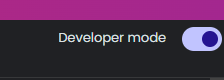
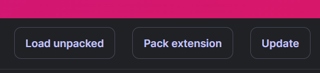
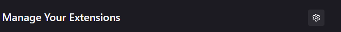
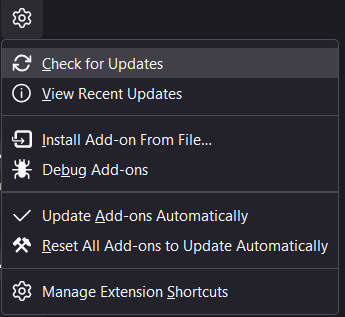
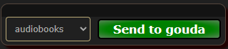

# Parmesan Extension

This is an extension for the [Gouda api](https://github.com/RA341/gouda), designed for the myanonmouse website.

## Installing

:::important
Currently, the extension is not published to the extension stores and manual installation is required.
:::

:::note
The scripts below are optional, all they do is download the latest extension release zip file,
and unzip them to make it easy to install/update the extension.

If you feel uncomfortable running the scripts, you can follow instructions [here](#manual-install) to manually download the extension.
:::

### Script install

* Open a terminal window
* Run the commands below

#### For windows

Feel free to inspect the [script](https://github.com/RA341/gouda/blob/release/install_scripts/extension.install.ps1)

```powershell
iex (iwr 'https://raw.githubusercontent.com/RA341/gouda/refs/heads/release/install_scripts/extension.install.ps1').Content
```

#### For linux/macos

Feel free to inspect the [script](https://github.com/RA341/gouda/blob/release/install_scripts/extension.install.sh)

```bash
curl -s 'https://raw.githubusercontent.com/RA341/gouda/refs/heads/release/install_scripts/extension.install.sh' | bash
```

### Manual install

1. Download the zip named `parmesan_extension.zip` from https://github.com/RA341/gouda/releases/latest
2. Place it in a directory, of your choosing
3. (Optional) Unzip if using chrome.

## Chrome setup

1. Open your browser, in the extensions tab, on the top right side corner enable `developer mode`
   > 
2. Next click on the `load unpacked` button and select the folder you unzipped.
    >
3. Next, [setup extension](#extension-setup)

##  Firefox setup

:::note
Unlike chrome, firefox can load the zip file directly.
:::

1. Open firefox and go to the extensions page.
2. Click the settings icon here,
    > 
3. Then click `install addon from file`
   > 
4. Select the zip file, you downloaded and install.
5. Next, [setup extension](#extension-setup)

:::important
 
This only applies to firefox users.

If you are running gouda in a different machine but on the same network, you must use a https domain.

What this means is if you are running gouda in another machine at IP: `http://192.168.1.43:9862`,

this address will not work, you must use a domain name: e.g. `https://gouda.example.com` (which points to `http://192.168.1.43:9862`)

If you are using gouda locally i.e. it is running on your machine, then you can ignore the above note
:::

## Extension setup
1. if you've followed, the instructions above, the extension should now be loaded, with the icon
2. Click it, and enter your api instance url and apikey (can be found from the gouda web ui settings page)
3. That's all folks!!
4. Go to any book release on the site, and you should have this button near the download button.
    > 

:::note
The dropdown will show an error, if you have not created any [categories](category.md).
if you do not have categories set them up via the gouda webui.
:::
