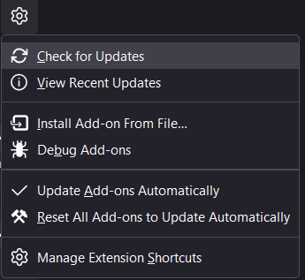

# Parmesan

This is an extension for the [Gouda api](https://github.com/RA341/gouda), designed for the myanonmouse website.

## Installing

> [!IMPORTANT]
Currently, the extension is not published to the extension stores and manual installation is required.

> [!NOTE]
> The scripts below are optional, all they do is download the latest extension release zip file,
> and unzip them to make it easy to install/update the extension.
>
> If you feel uncomfortable running the scripts, you can follow instructions [here](#manual-install) to manually download the extension.

### Script install

* Open a terminal window
* Run the commands below

#### For windows

Feel free to inspect the [script](../install_scripts/extension.install.ps1)

```powershell
iex (iwr 'https://raw.githubusercontent.com/RA341/gouda/refs/heads/release/install_scripts/extension.install.ps1').Content
```

#### For linux/macos

Feel free to inspect the [script](../install_scripts/extension.install.sh)

```bash
curl -s 'https://raw.githubusercontent.com/RA341/gouda/refs/heads/release/install_scripts/extension.install.sh' | bash
```

### Manual install

1. Download the zip from https://github.com/RA341/gouda/releases/latest
2. Unzip the downloaded file, it will contain a single directory named dist.

### Chrome setup

1. Open your browser, in the extensions tab, on the top right side corner enable developer mode
    * 
2. Next click on the load unpacked button and select the folder you unzipped.
3. Next, [setup the extension](#extension-setup) 

### Firefox setup

1. Download the zip from https://github.com/RA341/gouda/releases/latest
2. Unlike chrome, firefox can load the zip file directly.
3. Open firefox and go to the extensions page.
4. Click the settings icon here, 
5. Then click `install addon from file`
   * 
6. Select the zip file and install.
7. Next, [setup the extension](#extension-setup) 

> [!IMPORTANT]
> This only applies to firefox users.
>
> If you are running gouda in a different machine but on the same network, you must use a https domain.
>
> What this means is if you are running gouda in another machine at IP: `http://192.168.1.43:9862`,
> 
> this address will not work, you must use a domain name: e.g. `https://gouda.example.com` (which points to `http://192.168.1.43:9862`)


### Extension setup
1. if you've followed, the instructions above, the extension should now be loaded, with the icon
    * 
2. Click it, and enter your api instance url and apikey (can be found from the gouda web ui settings page)
3. That's all folks!!
4. Go to any book release on the site, and you should have this button near the download button.
    * 

> [!NOTE]  
> The dropdown will show an error, if you have not created any categories.
>
>  if you do not have categories set them up via the gouda webui.


## For Developers

### 🛠 Build locally

1. Checkout the copied repository to your local machine eg. with `git clone https://github.com/RA341/gouda`
2. Run `npm install` to install all required dependencies
3. Run `npm run build`

The build step will create the `distribution` folder, this folder will contain the generated extension.

### 🏃 Run the extension

Using [web-ext](https://extensionworkshop.com/documentation/develop/getting-started-with-web-ext/) is recommended for automatic reloading and running in a dedicated browser instance. Alternatively you can load the extension manually (see below).

1. Run `npm run watch` to watch for file changes and build continuously
1. Run `npm install --global web-ext` (only only for the first time)
1. In another terminal, run `web-ext run -t chromium`
1. Check that the extension is loaded by opening the extension options ([in Firefox](media/extension_options_firefox.png) or [in Chrome](media/extension_options_chrome.png)).

#### Manually

You can also [load the extension manually in Chrome](https://www.smashingmagazine.com/2017/04/browser-extension-edge-chrome-firefox-opera-brave-vivaldi/#google-chrome-opera-vivaldi) or [Firefox](https://www.smashingmagazine.com/2017/04/browser-extension-edge-chrome-firefox-opera-brave-vivaldi/#mozilla-firefox).

### 📕 Read the documentation

Here are some websites you should refer to:

- [Parcel’s Web Extension transformer documentation](https://parceljs.org/recipes/web-extension/)
- [Chrome extensions’ API list](https://developer.chrome.com/docs/extensions/reference/)
- A lot more links in my [Awesome WebExtensions](https://github.com/fregante/Awesome-WebExtensions) list

## Configuration

The extension doesn't target any specific ECMAScript environment or provide any transpiling by default. The extensions output will be the same ECMAScript you write. This allows us to always target the latest browser version, which is a good practice you should be following.

### Parcel 2

Being based on Parcel 2 and its [WebExtension transformer](https://parceljs.org/recipes/web-extension/), you get all the good parts:

- Browserlist-based code transpiling (which defaults to just the latest Chrome and Firefox versions)
- Automatically picks up any new file specified in `manifest.json`

### Auto-syncing options

Options are managed by [fregante/webext-options-sync][link-options-sync], which auto-saves and auto-restores the options form, applies defaults and runs migrations.

### Publishing

It's possible to automatically publish to both the Chrome Web Store and Mozilla Addons at once by adding these secrets on GitHub Actions:

1. `CLIENT_ID`, `CLIENT_SECRET`, and `REFRESH_TOKEN` from [Google APIs][link-cws-keys].
2. `WEB_EXT_API_KEY`, and `WEB_EXT_API_SECRET` from [AMO][link-amo-keys].

Also include `EXTENSION_ID` in the secrets ([how to find it](https://stackoverflow.com/a/8946415/288906)) and add Mozilla’s [`gecko.id`](https://developer.mozilla.org/en-US/docs/Mozilla/Add-ons/WebExtensions/manifest.json/browser_specific_settings) to `manifest.json`.

The GitHub Actions workflow will:

1. Build the extension
2. Create a version number based on the current UTC date time, like [`19.6.16`](https://github.com/fregante/daily-version-action) and sets it in the manifest.json
3. Deploy it to both stores

#### Auto-publishing

Thanks to the included [GitHub Action Workflows](.github/workflows), if you set up those secrets in the repo's Settings, the deployment will automatically happen:

- on a schedule, by default [every week](.github/workflows/release.yml) (but only if there are any new commits in the last tag)
- manually, by clicking ["Run workflow"](https://github.blog/changelog/2020-07-06-github-actions-manual-triggers-with-workflow_dispatch/) in the Actions tab.

## Credits

Extension icon made by [Freepik](https://www.freepik.com) from [www.flaticon.com](https://www.flaticon.com) is licensed by [CC 3.0 BY](http://creativecommons.org/licenses/by/3.0).
